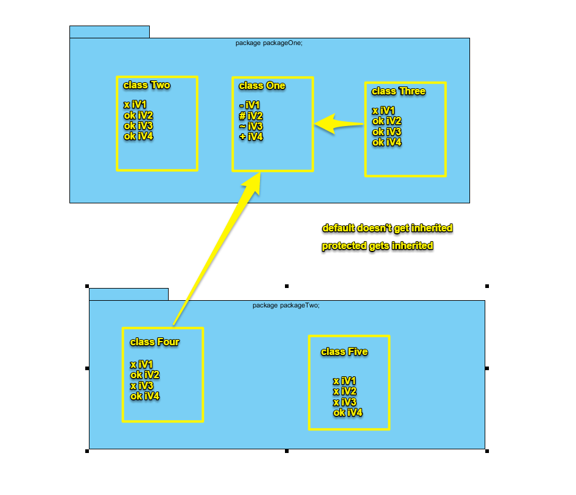
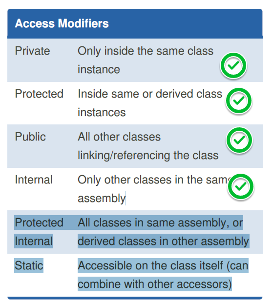

<!DOCTYPE html>
<html lang="en">
<head>
    <meta charset="UTF-8">
    <title>Access Modifiers</title>
</head>
    <body>
        <h1>This project demonstrates the usage of public, private, protected and default access modifiers</h1>
            
        
        

        

    </body>
</html>
